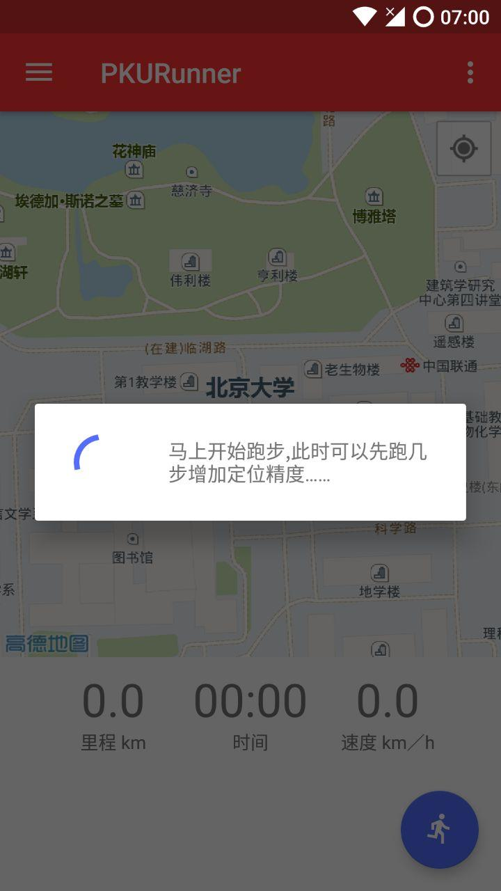
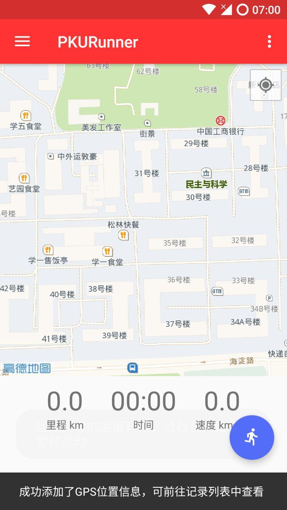
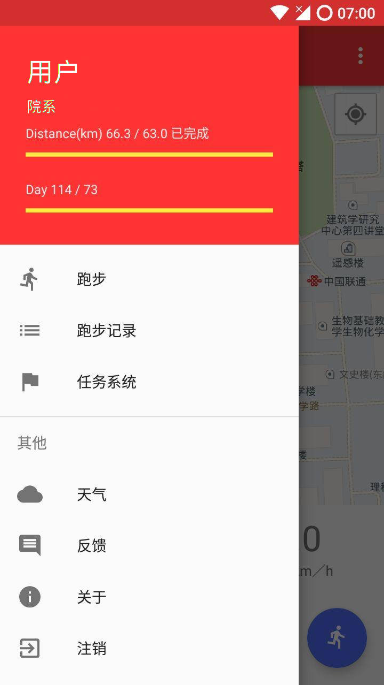
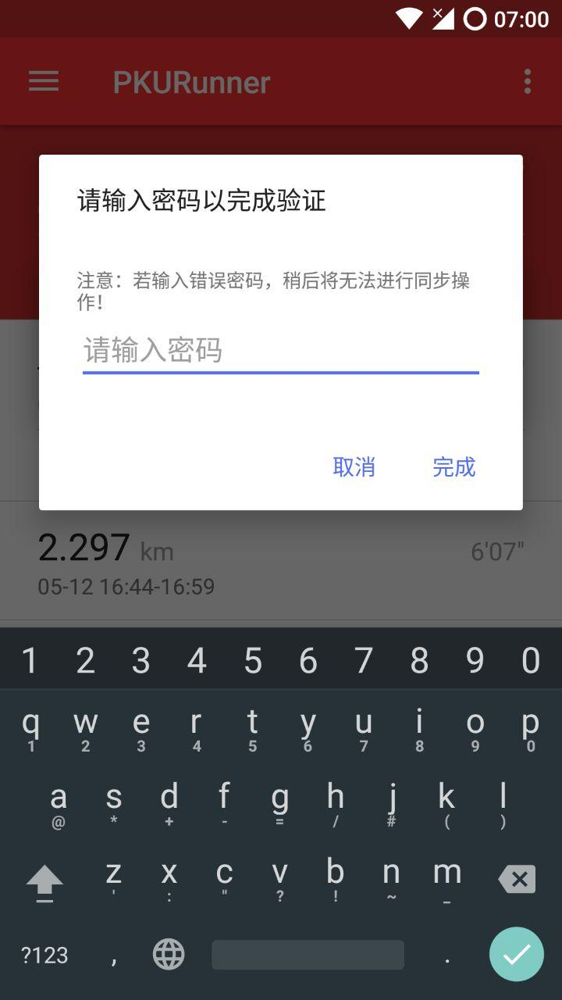
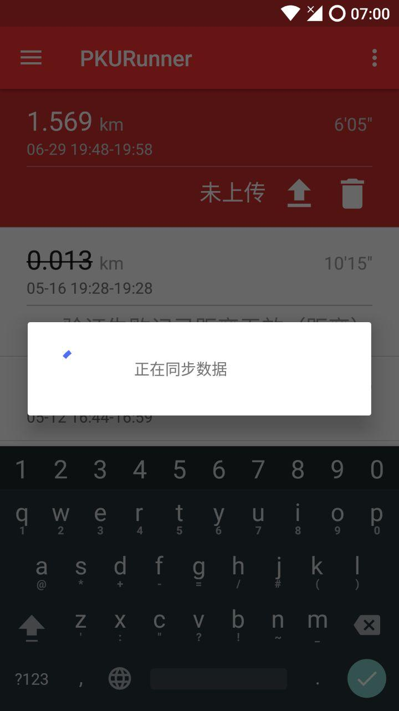
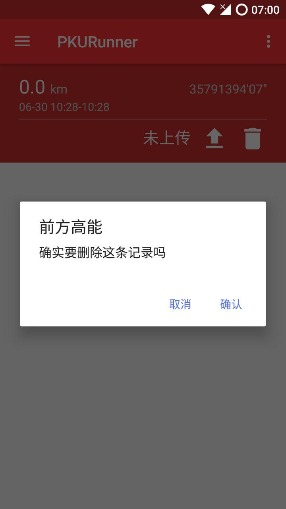
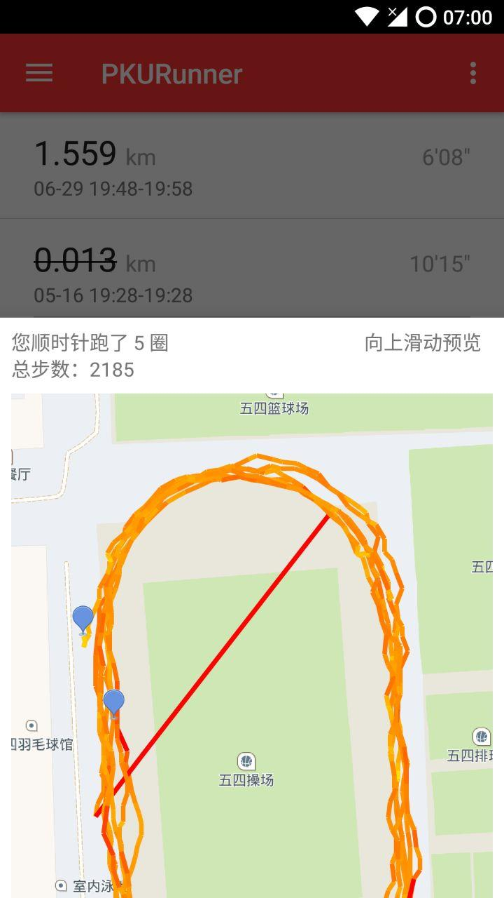

# PKU Runner Android 客户端使用说明
## 下载
用户可以通过多种渠道下载本软件：
+ PKU Runner 主页 [https://pku-runner.github.io/](https://pku-runner.github.io/)
+ 直接链接下载 [http://162.105.205.61:10201/apks/pkurunner-latest.apk](http://162.105.205.61:10201/apks/pkurunner-latest.apk)
+ 酷安市场页面 [http://www.coolapk.com/apk/cn.edu.pku.pkurunner](http://www.coolapk.com/apk/cn.edu.pku.pkurunner)

## 登录
- 首次使用本软件时将会出现引导页面；在这个过程中应用将会提示用户授予必要的权限（可在登陆后重新授权）。
- 使用 iaaa 验证的账号和密码登录

- 登陆后进入本软件的主界面

## 跑步
- 在 __跑步__ 界面点击右下角的蓝色按钮即可开始跑步
- 开始跑步前可能需要一点时间进行定位，请稍安勿躁

- 开始跑步后随时可以按左下角暂停键以暂停跑步

- 跑步结束时按右下角的停止按钮以保存记录，此后可进入 __跑步记录__ 界面查看

## 查看/上传记录
- 从左侧滑出侧边栏（或点击左上角的菜单按钮），点击进入 __跑步记录__ 界面

- 下拉记录表以从服务器同步数据；记录分条呈现，共有三种状态：
  + 未上传（红色背景）：可选择上传/删除操作
  + 验证未通过（白色背景，提示验证失败的原因）
  + 验证已通过（白色背景）

### 上传记录
- 点击未上传记录的上传按钮，出现输入 iaaa 密码验证的提示框

_注：如果输入密码错误，将无法进行同步操作，但是仍可以重新验证密码上传记录_

- 上传完毕后表格会自动更新，并在底部显示验证情况
### 删除记录
- 仅能删除未上传的记录，并且上传后无法恢复
- 点击未上传记录的删除按钮，出现确认对话框，点击 _确认_ 以删除

### 查看记录详情
- 点击记录的非按钮部分，可查看跑步的详细情况
  + 圈数（实验性功能）
  + 步数
  + 跑步速度可视化，颜色越红表示速度越快

## 任务系统
- 从左侧滑出侧边栏（或点击左上角的菜单按钮），点击进入 __任务系统__ 界面

- 点击任务条目可查看任务详情

## 权限管理
- 若未在引导页面授予本软件权限，可在应用的全局菜单（右上角菜单键进入）的 __权限管理__ 界面中进行授权

_注：Android 4.4 （含）以下的系统无需进行授权_

## 侧边栏

### 跑步进度
跑步进度显示在侧边栏最上方红色背景区域，包括本学期打卡的剩余时间与里程数

_注：若发生显示的里程数与任务系统中不一致的情况，请以侧边栏显示的数据为准_
### 天气
点击可刷新，包含必要的环境与空气信息
### 反馈
点击跳转软件反馈页面
### 关于
点击出现本软件制作组与说明界面
### 注销
点击清空本用户 __所有__ 跑步数据并回到登录界面
__注：如果出现无法上传等情况，请第一时间联系开发组反馈问题。如果擅自注销后发现数据丢失，本开发组不承担恢复数据的责任！__
